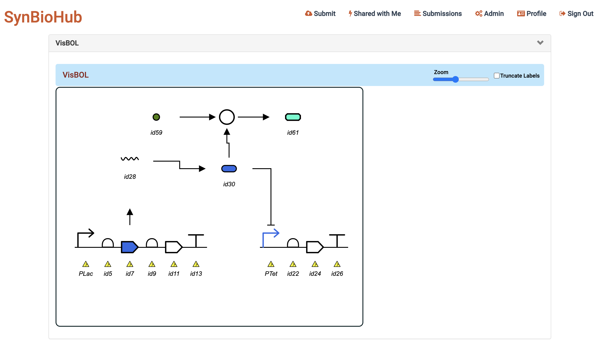

Welcome the the VisBOL 2.1 plugin!

# Project Description

VisBOL 2.1 is a visualization plugin engine for SynBioHub that allows SBOLCanvas designs to be visualized directly on SynBioHub. It also uses the "visbol" and "visbol-react" packages to create visualizations for standard SBOL files.

# Interface

# Local Installation / Testing

Follow the instructions on the [GitHub README](https://github.com/SynBioHub/synbiohub#manual-installation) to install SynBioHub locally on your system and start the SynBioHub process. In the Admin module, configure the plugin as follows:

1. Clone the VisBOL2.1 Plugin repository `git clone https://github.com/SynBioHub/Plugin-Visual-VisBOL.git`
2. Change to the VisBOL2.1 Plugin directory `cd Plugin-Visual-VisBOL`
3. Install all the dependencies `yarn install`
4. Build the repository `yarn run build`

If you're using the plugin on your local SynBioHub, run `yarn run local`. It assumes your local SynBioHub is on port 7777 (see line 46 of localserver.js).

Once you have the local plugin running, you can test it out by creating a design in SBOLCanvas, downloading the file as an SBOL file, and uploading it back to your local SynBioHub. You can then click on the top level layout object and view the plugin to see the design on SBOLCanvas.

There are two important things to note here. 

1) The visualization arrows don't seem to be accurately reflected by the plugin visualization. This is probably due to the plugin using a virtual DOM.

2) If the SBOLCanvas file has already been uploaded to SynBioHub, it can cause the submission to behave strangely, and will sometimes prevent the plugin from being able to read the layout file. Only submit brand new designs for testing.

If you're not planning to use the plugin on a local SynBioHub, you will be using server.js. You can run it using `yarn run start`. This should be configured to work if used on the official SynBioHub. See the Publish section below.

# Publish

Releases are published automatically to DockerHub using GitHub Actions. There is an action which fires when the github repository is pushed to. It publishes an image to Docker Hub as synbiohub/plugin-visual-visbol, which will eventually be used in public SynBioHub. It should be noticed that docker use server.js to start the server.

I am still waiting for a https address to be set up for me so that I can test the plugin on the official SynBioHub. In particular, I would like to see if the plugin works when SBOLCanvas exports the design directly to SBH. As I have only been able to run the plugin on my local SynBioHub, I have not been able to test this yet.